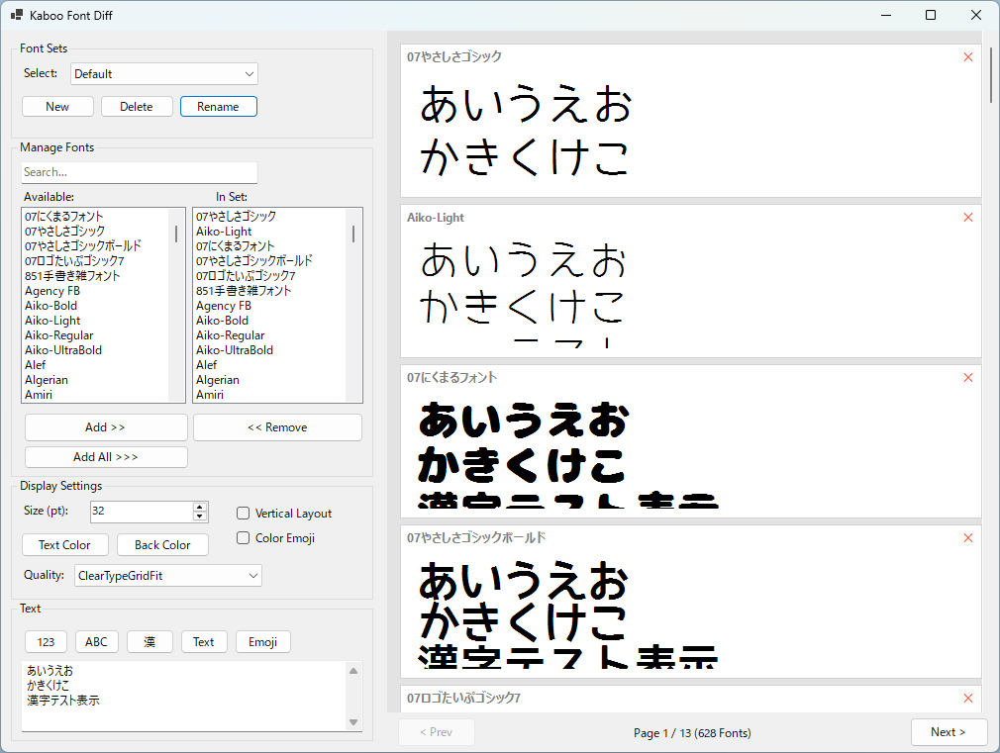

# Kaboo Font Diff

**Kaboo Font Diff** is a lightweight yet powerful Windows application designed for comparing installed fonts. It helps designers and developers verify how specific text renders across different typefaces, including support for Japanese vertical layout and Color Emojis.

## Features

- **Side-by-Side Comparison**: Preview customizable text across multiple fonts simultaneously.
- **Font Sets**: Create and save collections of fonts (e.g., "Coding Fonts", "Mincho Styles", "UI Candidates") for quick switching.
- **Advanced Filtering**: Search fonts by name and bulk-add them to your comparison set ("Add All Filtered").
- **Vertical Layout Support**: Full support for Japanese vertical writing mode (tategaki).
- **Color Emoji Support**: Render modern Color Emojis (Segoe UI Emoji, etc.) faithfully using native rendering.
- **Dark Mode Preview**: Toggle background and text colors to test font legibility in different themes.
- **Pagination**: Handle large font collections smoothly with built-in page navigation.

## System Requirements

- **OS**: Windows 11
- **Runtime**: .NET 10.0 Desktop Runtime

## Installation

1. Download the latest release (`kaboofontdiff_win64_v1000.zip`).
2. Unzip the archive to a folder of your choice.
3. Run `KabooFontDiff.exe`.

## Usage

Please refer to the [User Manual (index.html)](index.html) included in the repository for detailed instructions.

## License

This project is licensed under the MIT License - see the LICENSE file for details.

---
&copy; 2026 Kaboo Font Diff
